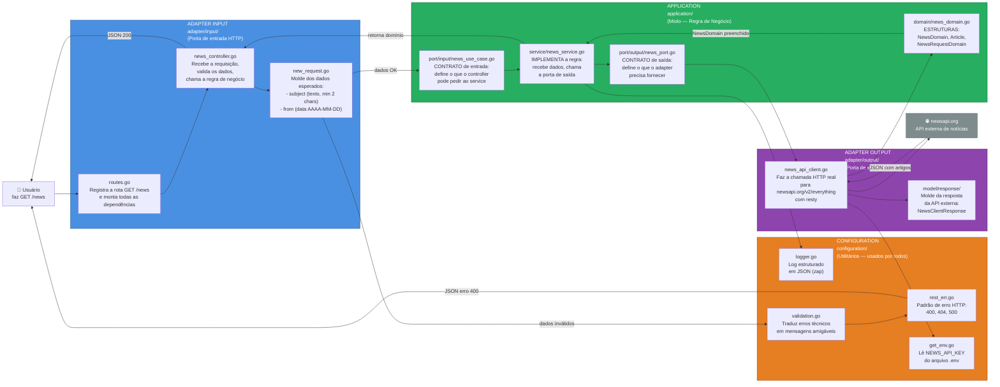
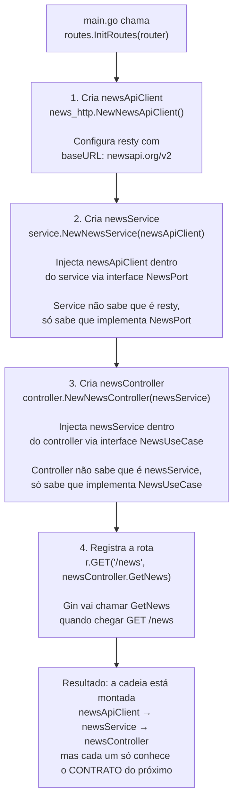
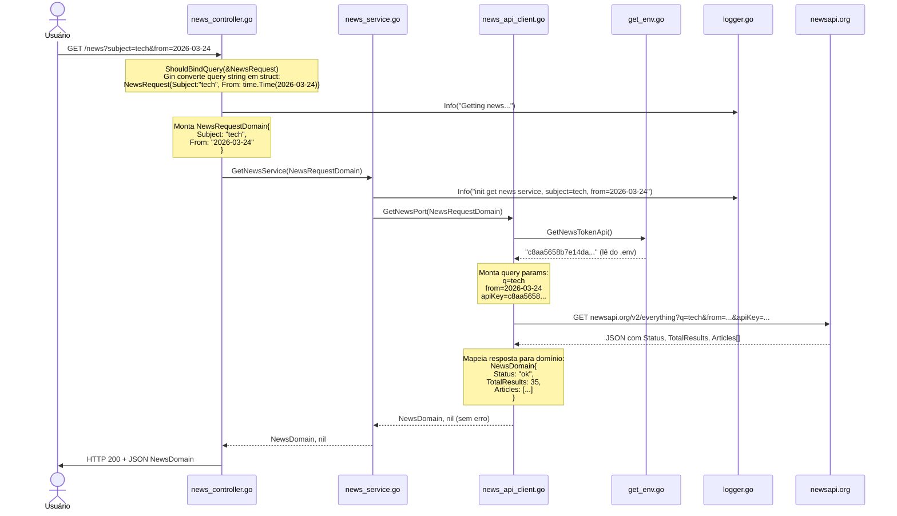
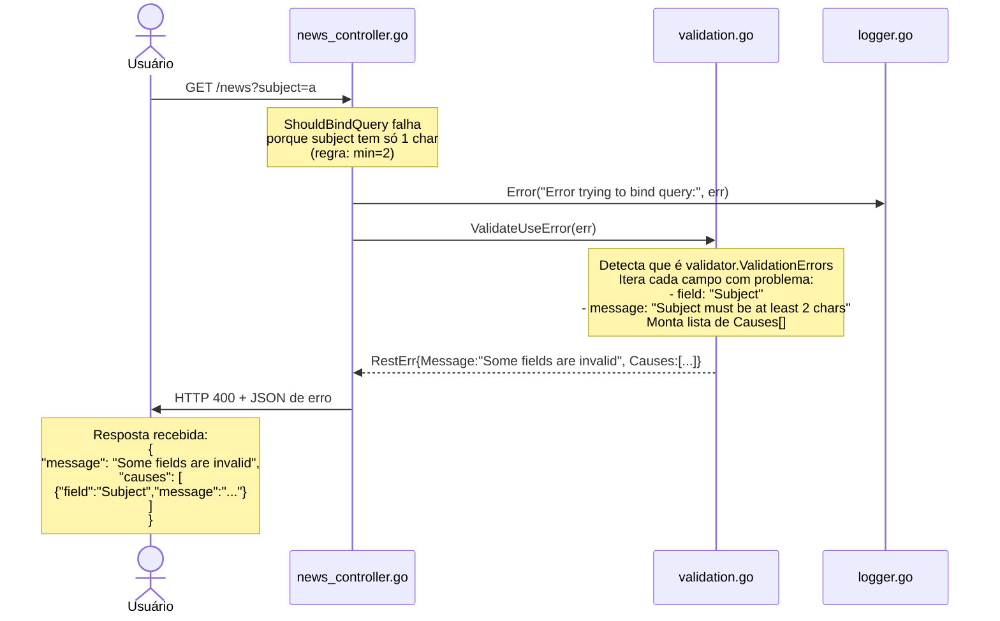
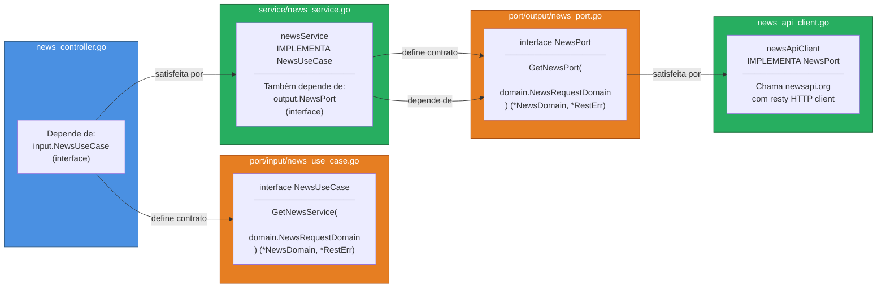
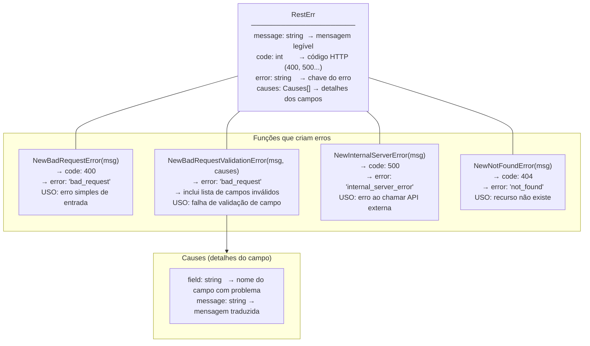
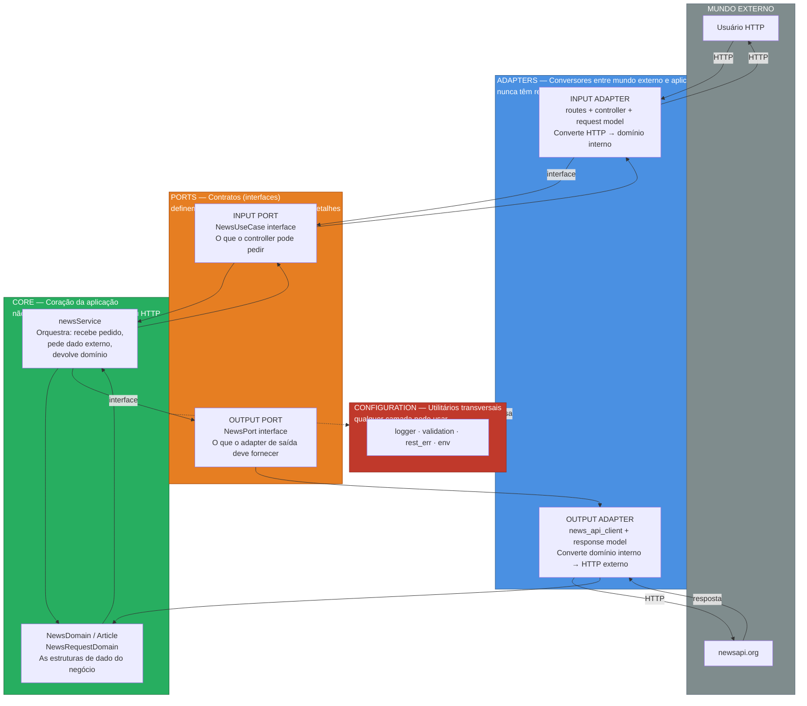

# Fluxogramas da Arquitetura Hexagonal

---

## O que é Arquitetura Hexagonal? (Explicação simples)

Imagine uma **cebola com camadas**. A parte mais interna (o miolo) é a regra de negócio — o que seu sistema realmente faz. As camadas de fora são responsáveis por **falar com o mundo externo** (receber chamadas HTTP, chamar APIs, banco de dados, etc.).

A regra de ouro é: **o miolo nunca sabe quem está do lado de fora**. Ele só conhece contratos (interfaces). Isso permite trocar um banco de dados, uma API externa ou um framework HTTP sem mexer na lógica de negócio.

```
    ┌──────────────────────────────────────────────────────────┐
    │  MUNDO EXTERNO                                           │
    │  (Usuário HTTP, News API, etc.)                          │
    │                                                          │
    │   ┌────────────────────────────────────────────────┐     │
    │   │  ADAPTERS (Tradutores)                         │     │
    │   │  Convertem o mundo externo para a linguagem    │     │
    │   │  interna da aplicação e vice-versa             │     │
    │   │                                                │     │
    │   │   ┌──────────────────────────────────────┐     │     │
    │   │   │  PORTS (Contratos / Interfaces)      │     │     │
    │   │   │  Definem o que pode entrar e sair    │     │     │
    │   │   │  sem expor os detalhes internos      │     │     │
    │   │   │                                      │     │     │
    │   │   │   ┌──────────────────────────────┐   │     │     │
    │   │   │   │  CORE (Miolo — Negócio Puro) │   │     │     │
    │   │   │   │  Service + Domain            │   │     │     │
    │   │   │   │  Não depende de nada externo │   │     │     │
    │   │   │   └──────────────────────────────┘   │     │     │
    │   │   └──────────────────────────────────────┘     │     │
    │   └────────────────────────────────────────────────┘     │
    └──────────────────────────────────────────────────────────┘
```

---

## Mapa do Projeto — Arquivo por Arquivo

Antes dos diagramas, veja onde cada arquivo vive e o que é responsável por fazer:

```
Hexagonal/
│
├── main.go                              ← Ponto de partida. Liga tudo.
│
├── adapter/                             ← TRADUTORES (falam com o mundo externo)
│   ├── input/                           ← Entrada: recebe chamadas HTTP
│   │   ├── routes/routes.go             ← Define quais URLs existem e monta dependências
│   │   ├── controller/news_controller.go← Recebe a requisição, valida, chama regra de negócio
│   │   └── model/request/new_request.go ← Molde dos dados que o usuário precisa enviar
│   │
│   └── output/                          ← Saída: faz chamadas para fora
│       ├── news_http/news_api_client.go ← Chama a API externa newsapi.org
│       └── model/response/              ← Molde da resposta que a API externa devolve
│
├── application/                         ← MIOLO (regra de negócio pura)
│   ├── domain/news_domain.go            ← As estruturas de dados do negócio
│   ├── port/
│   │   ├── input/news_use_case.go       ← Contrato: o que a camada de entrada pode pedir
│   │   └── output/news_port.go          ← Contrato: o que a camada de saída precisa fazer
│   └── service/news_service.go          ← Implementa a regra de negócio
│
├── configuration/                       ← UTILITÁRIOS (usados por qualquer camada)
│   ├── env/get_env.go                   ← Lê variáveis de ambiente (.env)
│   ├── logger/logger.go                 ← Sistema de log estruturado
│   ├── rest_err/rest_err.go             ← Padrão de resposta de erro HTTP
│   └── validation/validation.go         ← Traduz erros de validação para mensagens amigáveis
│
└── .env                                 ← Configurações sensíveis (token da API, etc.)
```

---
## Diagrama 1 — Visão Geral das Camadas

> **Para iniciantes:** Pense nisso como um funil. A requisição do usuário entra pelo lado esquerdo, passa pelas camadas, busca dado real numa API externa e a resposta volta. Cada caixa tem uma responsabilidade bem separada.



---

## Diagrama 2 — Como as Dependências são Montadas (routes.go)

> **Para iniciantes:** Antes de qualquer requisição chegar, o `routes.go` já montou a "cadeia de dependências" como peças de Lego encaixadas. Cada peça só conhece o contrato da próxima, nunca a implementação direta.



---

## Diagrama 3 — Fluxo Completo de uma Requisição (Caminho Feliz)

> **Para iniciantes:** Este é o passo a passo exato de O QUE ACONTECE no código quando você chama `GET /news?subject=tech&from=2026-03-24` e tudo dá certo.



---

## Diagrama 4 — Fluxo de Erro (Validação Falha)

> **Para iniciantes:** O que acontece quando o usuário manda dados errados? Por exemplo, `subject=a` (menos de 2 caracteres) ou sem a data `from`.



---

## Diagrama 5 — O Papel dos Contratos (Interfaces / Ports)

> **Para iniciantes:** As interfaces são como "tomadas padronizadas". O controller não sabe se está falando com `newsService` ou outro service qualquer — só sabe que o "plugue" (interface `NewsUseCase`) encaixa. O mesmo vale para o service com o API client.



---

## Diagrama 6 — Estrutura do Erro REST (rest_err.go)

> **Para iniciantes:** Toda vez que algo dá errado, a API responde com um JSON padronizado. Este diagrama mostra quais tipos de erro existem e quando cada um é usado.



---

## Diagrama 7 — Sistema de Log (logger.go)

> **Para iniciantes:** O logger grava tudo que acontece na aplicação em formato JSON para facilitar monitoramento. Você configura o destino e o nível pelo `.env`.

```mermaid
flowchart LR
    env_log["Variáveis no .env\n─────────────────\nLOG_OUTPUT=stdout\nLOG_LEVEL=info"]

    subgraph logger_init["init() — roda automaticamente ao iniciar"]
        parse["Lê LOG_OUTPUT e LOG_LEVEL\ndo ambiente"]
        build["Monta zap.Config:\n- encoding: JSON\n- campos: level, time, message"]
        create["Cria logger global\nlog *zap.Logger"]
    end

    subgraph funcs["Funções disponíveis"]
        info_fn["logger.Info(msg, ...fields)\nNível: INFO\nUso: eventos normais"]
        error_fn["logger.Error(msg, err, ...fields)\nNível: INFO (com campo 'error')\nUso: erros ocorridos"]
    end

    subgraph output_ex["Exemplo de saída JSON"]
        json_out["{\"level\":\"info\",\n\"time\":\"2026-03-24T10:00:00\",\n\"message\":\"Getting news...\"}"]
    end

    env_log --> parse --> build --> create
    create --> info_fn
    create --> error_fn
    info_fn --> json_out
    error_fn --> json_out
```

---

## Diagrama 8 — Resumo Visual das Camadas (para colar na cabeça)


